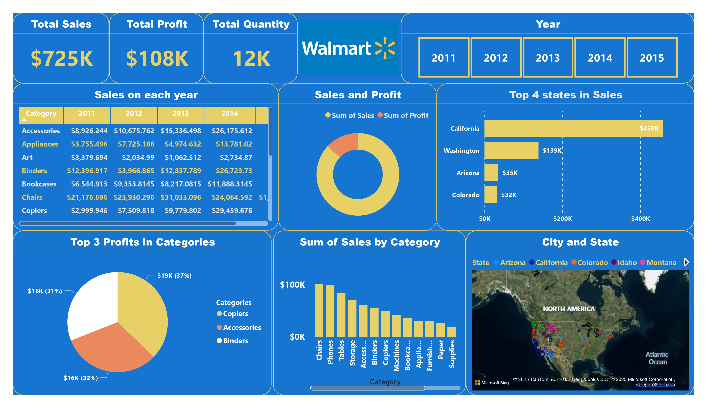

# 🧠 Walmart Sales Data Analysis (2011–2015)

This project uses Power BI to analyze Walmart's sales data from 2011 to 2015. It explores trends in sales, profit, and category performance across different states and customer segments.

## 📌 Problem Statement
Walmart generates vast amounts of transactional data. To make better business decisions, it is essential to visualize and analyze the data to uncover trends, top-performing product categories, seasonal impacts, and profit drivers. This project addresses these needs using Power BI.

## 🎯 Objectives
- Analyze historical sales and profit data from 2011–2015.
- Identify top-performing product categories and customer regions.
- Track monthly and yearly sales/profit trends.
- Understand the contribution of each category to overall business.
- Highlight cities/states with the highest revenue generation.

## 🛠️ Tools Used
- Power BI
- Microsoft Excel
- DAX (Data Analysis Expressions)

## 🪜 Process

1. **Data Collection**
   - Used Walmart sales dataset with fields like Order Date, Category, Product, Sales, Quantity, Profit, City, and State.

2. **Data Preprocessing**
   - Checked for missing values, validated date ranges and data types.
   - Reformatted dates for visual-friendly reporting (Year, Month, Quarter).

3. **Loading into Power BI**
   - Imported the Excel sheet.
   - Created date hierarchies and necessary relationships (if needed).

4. **Data Modeling**
   - Created calculated fields like:
     - `Total Sales`
     - `Total Profit`
     - `Profit Margin`
     - `Sales by Category/State/Year`

5. **Visualizations**
   - Bar and line charts for sales and profit over time.
   - Donut and pie charts to compare category-wise performance.
   - Geographic map to analyze regional sales across the U.S.
   - KPI Cards showing Total Sales, Total Profit, Top State, and Top Category.
   - Filters and slicers for user interaction.

## 📊 Dashboard Highlights
- 📅 **Time Series Analysis**: Sales and profit growth across 5 years.
- 🛍️ **Category Performance**: Binders, Phones, Art among top-selling categories.
- 🗺️ **Regional Insights**: States like California and New York contributed heavily to revenue.
- 🏷️ **Profitability**: Identified categories with high sales but low profit margins.
- 🧮 **KPIs**: Real-time summary of key performance indicators.

## 📌 Key Insights
- Sales peak around specific quarters annually.
- High-profit margins in Phones and Binders.
- Large orders are concentrated in metropolitan cities.
- Some categories like "Labels" have consistent but low-volume sales.

## 📁 Files
- `Walmart_2011-2015.pbix` - Power BI Dashboard
- `Walmart.xlsx` - Raw data source

## 📷 Dashboard Preview

## 📬 Contact
For any queries, contact: **Kenis Glanen Doss Arockia Diviyanathan**  
📧 Email: kenglanen@gmail.com  
